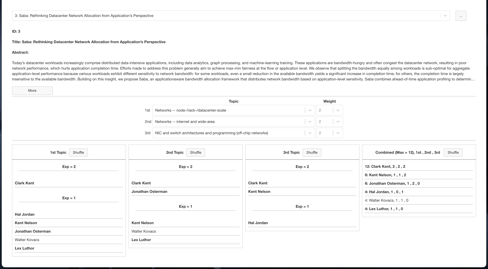
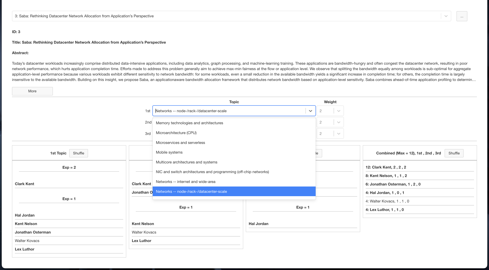
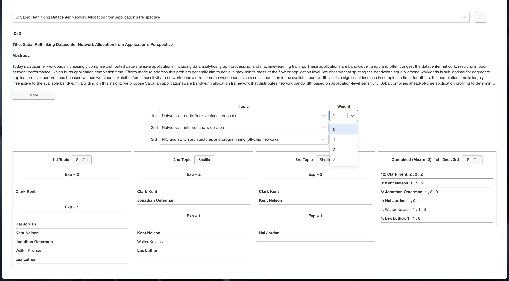

-------------------------------------------------------------------------------

# PiCkeR - Toolkit for Conference Program Chairs

-------------------------------------------------------------------------------

**Table of Contents**

- [Description](#description)
- [How it works](#how-it-works)
- [Prerequisites](#prerequisites)
- [Input Files](#input-files)
- [Build and Run](#build-and-run)
- [License](#license)
- [Contribution](#contribution)
- [Contacts](#contacts)

## Description
This repository contains PiCkeR, a web-based application that aims to streamline the process of selecting and sorting reviewers for conference papers.
PiCkeR was initially developed for and used in MICRO 2022 conference. 

## How it works
This tool sorts reviewers based on their expertise levels for each paper. The paper and PC information must be collected from HoTCRP and fed to the tool. In addition, it requires the list of topics that are defined in HoTCRP.
  
### Paper Details
PiCkeR provides a comprehensive view of each paper, including its abstract and the list of topics associated with it. For each topic, PiCkeR displays a column that shows the PC members who have expertise in that particular topic. The PC members are sorted within each topic column based on their level of expertise.

In addition to the expertise-based sorting within each topic, PiCkeR includes an additional column that lists the PC members based on their overall score across associated topics. 
This column provides an aggregated view of the PC members' expertise and helps identify individuals with broad knowledge across multiple topics. Conference program chairs can use this information and the shuffle button to ensure a balanced distribution of expertise among the reviewers. 


### Selecting the Right Topics
PiCkeR offers flexibility in selecting the right topics for each paper, allowing conference program chairs to make adjustments based on the abstract of the paper. While the initial topics are extracted from the data collected from HoTCRP, program chairs can modify or refine the selected topics to ensure an accurate representation of the paper's content.



### Assigning Weights to Topics
PiCkeR allows conference program chairs to assign weights to each topic, which affects the calculation of the overall score for PC members. The weights reflect the relative importance or priority of each topic in the conference.




**Note 1:** PiCkeR has been created to be compatible with the HotCRP v3.0b3 and may not be compatible with the future version of HotCRP as HotCRP is being updated regularly.  
**Note 2:** PiCkeR uses email addresses registered with HotCRP to identify each reviewer uniquely.  
**Note 3:** With the current version, papers are assumed to have up to three topics.  
**Note 4:** Each reviewer has an expertise value from -2 (Low) to +2 (High). PiCkeR only considers values +1 and +2 in sorting reviewers.  

## Prerequisites
* pip
* Authlib==1.0.1
* certifi==2021.10.8
* cffi==1.15.0
* charset-normalizer==2.0.12
* click==8.1.3
* cryptography==37.0.1
* Flask==2.1.2
* Flask-Cors==3.0.10
* gunicorn==20.1.0
* idna==3.3
* itsdangerous==2.1.2
* Jinja2==3.1.2
* MarkupSafe==2.1.1
* numpy==1.22.3
* pandas==1.4.2
* pycparser==2.21
* python-dateutil==2.8.2
* python-dotenv==0.20.0
* pytz==2022.1
* requests==2.27.1
* six==1.16.0
* urllib3==1.26.9
* Werkzeug==2.1.2

## Input Files
To run, the following files are required:
* data.json, generated by HotCRP
* pcinfo.csv, generated by HotCRP
* topics.txt, manually generated, contains list of topics  

You must put these files under ```PiCkeR/static/input/``` directory.  
**Note:** You can use samples files (can be found under ```PiCkeR/static/Samples/``` directory) to test PiCkeR.  

## Build and Run
1. Clone the Github repository
   ```sh
   git clone https://github.com/mrkatebzadeh/PiCkeR.git
   ```

2. Install dependencies:
   ```sh
   pip install -r requirements.txt
   ```
3. Run PiCkeR:
   ```sh
   sh ./run.sh
   ```
4. Open <http://127.0.0.1:5001> on the browser.

## License

PiCkeR is licensed under GNU General Public License v2.0. 
Feel free to modify, use, and distribute it. 

## Contribution
PiCkeR may not suit your needs and may contain bugs and imperfections.
Therefore, we encourage users to add more features to it.
Please open a pull request if you want to add new features to PiCkeR or fix a little bug.

## Contacts

If you have any questions, please raise issues on Github or contact the authors below.

[M.R. Siavash Katebzadeh](http://mr.katebzadeh.xyz) (m.r.katebzadeh@ed.ac.uk)
<!-- markdown-toc end -->
